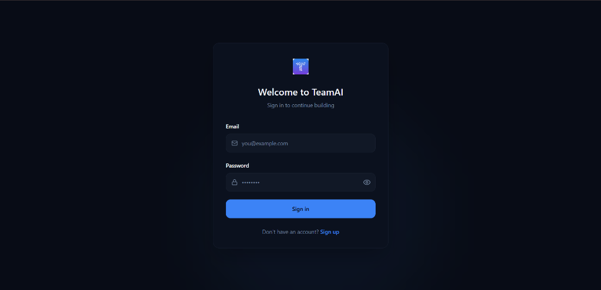
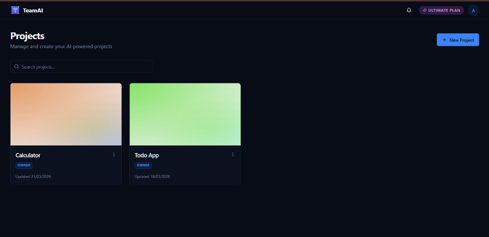
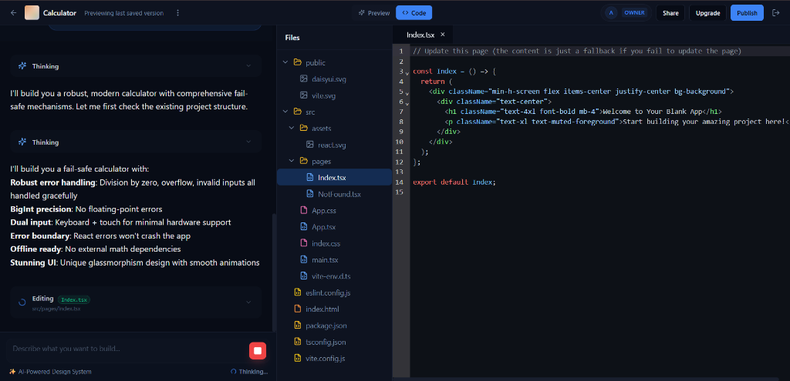
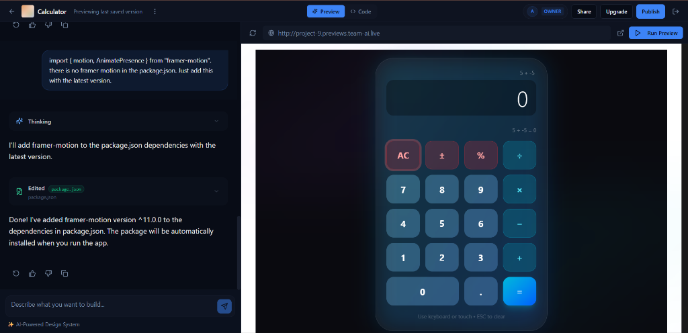
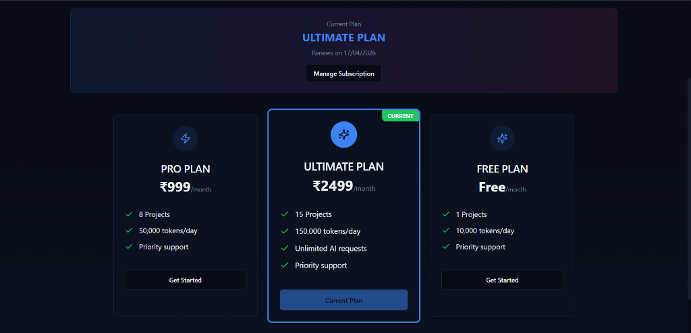

  
# 🚀 Distributed TeamAI 

**An Elite, Cloud-Native, AI-Driven Collaborative Workspace Engine**

 

## 📖 Overview

**Distributed TeamAI** represents the absolute cutting edge of AI-collaborative development environments. Designed from the ground up as a robust, highly scalable distributed system, it pairs a premium, high-performance React frontend with a resilient Spring Cloud microservices backend. 

This platform isn't just an AI wrapper; it is an **Agentic Orchestration Engine**. It possesses full contextual awareness of workspaces, dynamically provisions Kubernetes resources, streams AI generations via Server-Sent Events (SSE), and relies on a durable event-driven core for background processing.

---

## ✨ Platform Preview

Here is a glimpse of the Distributed TeamAI interface and AI-driven workspace:

  
   
  <em>Secure Authentication</em>

 

  
   
  <em>Projects Dashboard</em>

 

  
   
  <em>Real-time AI Coding & Cloud Workspace</em>

 

  
   
  <em>Streaming File Synchronization</em>

 

  
   
  <em>Subscription & Billing Management</em>

---

## 🏗️ Architecture & Advanced Tech Stack

This project is engineered using enterprise-grade, bleeding-edge technologies across the entire stack.

### 🌐 The Frontend (Client-Side Excellence)
A stunning, responsive, and dynamic web application engineered for developer experience (DX) and speed.

- **Core**: React 18, Vite, TypeScript (Strict Mode).
- **UI & Aesthetics**: Tailwind CSS 4, daisyUI v5, and shadcn/ui primitives. Animated with Framer Motion and Lucide React icons.
- **Code Intelligence**: `@uiw/react-codemirror` for real-time, syntax-highlighted code editing.
- **State & Data Fetching**: Zustand (implied) and `@tanstack/react-query` for high-performance server-state synchronization.
- **Forms & Validation**: `react-hook-form` paired with `zod` schema validation.
- **Streaming & Parsing**: Highly optimized continuous Server-Sent Events (SSE) stream parsing processing JSON-encoded data. Handles newline restoration flawlessly with aggressive heuristics to rebuild Markdown chunks dynamically and safely stream live AI generation.
- **Visualizations**: `recharts` for integrated analytics.

### 🧠 The Backend (Spring Cloud Microservices)
A completely decoupled, distributed microservices mesh leveraging **Java 21** Virtual Threads and the modern Spring ecosystem.

- **Infrastructure Core**:
  - **API Gateway**: `spring-cloud-starter-gateway-server-webflux` for reactive routing and cross-cutting concerns.
  - **Service Discovery**: Netflix Eureka Client & Server (`discovery-service`).
  - **Centralized Config**: Spring Cloud Config Server backed by Git/Local (`config-service`).

- **Intelligence Service (The AI Brain)**:
  - Built on **Spring AI 2.0.0-M2**, communicating concurrently with frontier LLMs (e.g., OpenRouter, OpenAI compatible APIs).
  - Employs **Advanced Function Calling** (Tools) to dynamically read/write to the Workspace. Tool calls are strictly enforced but dynamically triggered optionally to avoid deadlocks.
  - Implements an **Agentic Advisor Pattern** (e.g., `FileTreeContextAdvisor`) to inject dense, compacted context straight into the AI's prompting phase.
  - Leverages heavily-engineered internal Prompts featuring "Recency Bias", a flexible "5-Step Validation Protocol", and rigid architectural directives forcing the AI to generate multiple modular files rather than a monolithic dump.

- **Workspace Service (The Engine Room)**:
  - **Fabric8 Kubernetes Client**: Dynamically provisions and manages runner pods and isolated workspaces directly on the underlying K8s cluster.
  - **S3 Object Storage**: Uses MinIO Java SDK for robust file persistence and project synchronization.
  
- **Security & Communcation**:
  - **JWT Authentication** (`jjwt-api`) utilizing Spring Security.
  - Inter-service communication via **Spring Cloud OpenFeign**.

### ⚡ Infrastructure & Data Layer (Stateful Core)

The system relies on high-availability stateful components orchestrated in Kubernetes.

- **Vector Database**: **PostgreSQL** augmented with the **pgvector** extension. Crucial for handling dense AI embeddings, semantic search, and RAG (Retrieval-Augmented Generation) patterns.
- **Message Broker**: **Apache Kafka**. Drives the event-driven architecture (e.g., `FileStoreRequestEvent`), ensuring the streaming AI generation isn't bottle-necked by database or S3 write latency.
- **Caching & Ephemeral State**: **Redis**. Provides blazing-fast caching layers for the API Gateway and Workspace Service.
- **Object Storage**: **MinIO**. High-performance, S3-compatible storage.
- **Containerization**: 
  - Effortless, demonless Docker image creation using Google's **Jib Maven Plugin**.
  - Comprehensive **Kubernetes Manifests** (Deployments, Services, Network Policies, Ingress) defining namespaced (`distributed-team-ai-ns`) environments, stateful sets, and zero-trust proxy layers.

---

## 🛠️ Key Technical Achievements

1. **"Flexible but Strict" AI Orchestration**: Solved LLM "instruction fatigue" through prompt engineering, ensuring complex, multi-step actions (Thoughts ➡️ Intent ➡️ [Optional Search] ➡️ File Edit ➡️ Summary) never stall.
2. **Crash-Proof Tool Execution**: Bulletproofed backend AI tool execution using Try-Catch safety nets, preventing cascading server failures when an autonomous agent attempts invalid filesystem operations.
3. **Optimized Context Window Management**: Replaced verbose file tree dumps with condensed, mapped directory structures, effectively curing "Context Bloat" while giving the LLM flawless project vision.
4. **Resilient Markdown Streaming**: Implemented robust backend JSON-serialization for emitted Server-Sent Events, preserving raw newline characters entirely, and layered it with frontend fallback heuristics (`repairMarkdown` regex) that automatically reinsert missing formatting cues dynamically.
5. **Anti-Monolith File Generation**: Embedded rigid file structure awareness in AI system prompts. Forces language models out of common lazy patterns ("dumping everything in Index.tsx") to instead create highly modular, enterprise-level component hierarchies concurrently. 
6. **Event-Driven AI Sync**: Decoupled AI token generation from file saving using Apache Kafka. The UI stays incredibly fast while the backend uses Saga/event IDs to eventually-sync code edits to PostgreSQL and MinIO.

---

## 🏁 Getting Started

*(Instructions for local deployment via Minikube/Docker and environment variable configuration would go here. Please refer to the `/k8s` directory for core manifests.)*

---

> *"Built with passion, extreme strictness, and a touch of Agentic magic."* ✨
